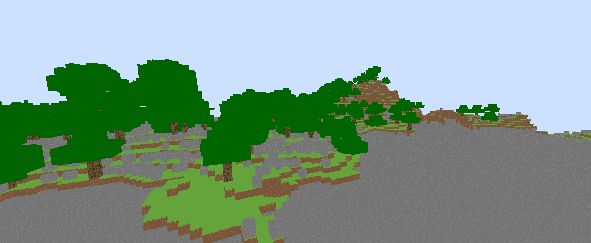

# villa

A clean-room implementation of the Minecraft Beta 1.7.3 client written in Rust.

Villa is in **extremely early alpha**. It lacks many features and is subject to crashing. However,
it has the potential to bring a new age to the beloved version of the game.

# Roadmap

- ✅ WGPU render backend
- ✅ Title screen
- ✅ Server networking
- ⌛ Block rendering
- ❌ Entity rendering
- ❌ Physics
- ❌ Inventories & GUIs
- ❌ Sound
- ❌ Atmospherics, weather

**Long-term goals**

- Custom Vulkan & Metal render backends
- Shaders, PBR, and other graphical enhancements
- Easy-access client-side scripting

# Credits

Font by [zedseven](https://github.com/zedseven/Pixellari)

Background by [Mockingjay1701](https://www.deviantart.com/mockingjay1701/art/Pixel-art-landscape-525082296)
